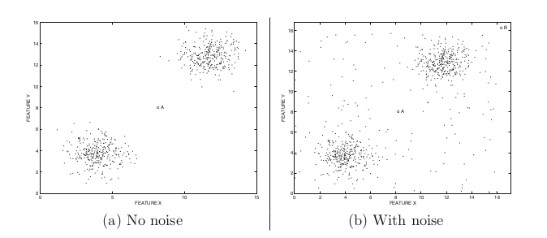

## 1、什么是异常检测

**异常检测（Outlier Detection）**，顾名思义，是识别与正常数据不同的数据，与预期行为差异大的数据。

识别如信用卡欺诈，工业生产异常，网络流里的异常（网络侵入）等问题，针对的是少数的事件。

### 1.1 异常的类别

**点异常**（point anomalies）指的是少数个体实例是异常的，大多数个体实例是正常的，例如正常人与病人的健康指标；

**条件异常**（conditional anomalies），又称上下文异常，指的是在特定情境下个体实例是异常的，在其他情境下都是正常的，例如在特定时间下的温度突然上升或下降，在特定场景中的快速信用卡交易；

**群体异常**（group anomalies）指的是在群体集合中的个体实例出现异常的情况，而该个体实例自身可能不是异常，在入侵或欺诈检测等应用中，离群点对应于多个数据点的序列，而不是单个数据点。例如社交网络中虚假账号形成的集合作为群体异常子集，但子集中的个体节点可能与真实账号一样正常。

### 1.2 异常检测任务分类

**有监督**：训练集的正例和反例均有标签

**无监督**：训练集无标签

**半监督**：在训练集中只有正例，异常实例不参与训练

### 1.3 异常检测场景

* **故障检测**：主要是监控系统，在故障发生时可以识别，并且准确指出故障的种类以及出现位置。主要应用领域包括银行欺诈、移动蜂窝网络故障、保险欺诈、医疗欺诈。

* **医疗日常检测**：在许多医疗应用中，数据是从各种设备收集的，如磁共振成像（MRI）扫描、正电子发射断层扫描（PET）扫描或心电图（ECG）时间序列。这些数据中的异常模式通常反映疾病状况。

* **网络入侵检测**：在许多计算机系统中，都会收集有关操作系统调用、网络流量或其他用户操作的不同类型的数据。由于恶意活动，此数据可能显示异常行为。对此类活动的识别称为入侵检测。

* **欺诈检测**：信用卡欺诈越来越普遍，因为信用卡号码等敏感信息更容易被泄露。在许多情况下，未经授权使用信用卡可能表现出不同的模式，例如从特定地点疯狂购买或进行非常大的交易。这种模式可用于检测信用卡交易数据中的异常值。

* **工业异常检测**

* **时间序列异常检测**

* **视频异常检测**

* **日志异常检测**

  

### 1.4 异常检测的难点

1.数据量少。异常检测任务通常情况下负样本（异常样本）是比较少的，有时候依赖于人工标签，属于样本不平衡问题。

2.噪音。异常和噪音有时候很难分清，如下图，图a的A点位于数据的稀疏区域，与其他数据非常不同，因此可以断定为异常，但是像图b的A点，周围有也有很多点分布，我们很难把A点识别出来。

## 2、异常检测方法简介

### 2.1 基础方法

#### 2.1.1 基于统计学的方法

统计学方法对数据的正常性做出假定。**它们假定正常的数据对象由一个统计模型产生，而不遵守该模型的数据是异常点。**统计学方法的有效性高度依赖于对给定数据所做的统计模型假定是否成立。

异常检测的统计学方法的一般思想是：学习一个拟合给定数据集的生成模型，然后识别该模型低概率区域中的对象，把它们作为异常点。

即利用统计学方法建立一个模型，然后考虑对象有多大可能符合该模型。

假定输入数据集为$\{x^{(1)}, x^{(2)}, ..., x^{(m)}\}$，数据集中的样本服从正态分布，即$x^{(i)}\sim N(\mu, \sigma^2)$，我们可以根据样本求出参数$\mu$和$\sigma$。

$\mu=\frac 1m\sum_{i=1}^m x^{(i)}$

$\sigma^2=\frac 1m\sum_{i=1}^m (x^{(i)}-\mu)^2$

#### 2.1.2 线性模型

典型的如PCA方法，Principle Component Analysis是主成分分析，简称PCA。它的应用场景是对数据集进行降维。降维后的数据能够最大程度地保留原始数据的特征（以数据协方差为衡量标准）。其原理是通过构造一个新的特征空间，把原数据映射到这个新的低维空间里。PCA可以提高数据的计算性能，并且缓解"高维灾难"。

#### 2.1.3 基于邻近度的方法

​		这类算法适用于数据点的聚集程度高、离群点较少的情况。同时，因为相似度算法通常需要对每一个数据分别进行相应计算，所以这类算法通常计算量大，不太适用于数据量大、维度高的数据。    

​		基于相似度的检测方法大致可以分为三类： 

* 基于集群（簇）的检测，如DBSCAN等聚类算法。    
  		聚类算法是将数据点划分为一个个相对密集的“簇”，而那些不能被归为某个簇的点，则被视作离群点。这类算法对簇个数的选择高度敏感，数量选择不当可能造成较多正常值被划为离群点或成小簇的离群点被归为正常。因此对于每一个数据集需要设置特定的参数，才可以保证聚类的效果，在数据集之间的通用性较差。聚类的主要目的通常是为了寻找成簇的数据，而将异常值和噪声一同作为无价值的数据而忽略或丢弃，在专门的异常点检测中使用较少。    

+ 基于距离的度量，如k近邻算法。    
  
   ​		k近邻算法的基本思路是对每一个点，计算其与最近k个相邻点的距离，通过距离的大小来判断它是否为离群点。在这里，离群距离大小对k的取值高度敏感。如果k太小（例如1），则少量的邻近离群点可能导致较低的离群点得分；如果k太大，则点数少于k的簇中所有的对象可能都成了离群点。为了使模型更加稳定，距离值的计算通常使用k个最近邻的平均距离。 
  
+ 基于密度的度量，如LOF（局部离群因子）算法。 

  ​		局部离群因子（LOF）算法与k近邻类似，不同的是它以相对于其邻居的局部密度偏差而不是距离来进行度量。它将相邻点之间的距离进一步转化为“邻域”，从而得到邻域中点的数量（即密度），认为密度远低于其邻居的样本为异常值。   

### 2.2 集成方法

集成是提高数据挖掘算法精度的常用方法。集成方法将多个算法或多个基检测器的输出结合起来。其基本思想是一些算法在某些子集上表现很好，一些算法在其他子集上表现很好，然后集成起来使得输出更加鲁棒。集成方法与基于子空间方法有着天然的相似性，子空间与不同的点集相关，而集成方法使用基检测器来探索不同维度的子集，将这些基学习器集合起来。

常用的集成方法有Feature bagging，孤立森林等。

**feature bagging **：

与bagging法类似，只是对象是feature。

**孤立森林**：

孤立森林假设我们用一个随机超平面来切割数据空间，切一次可以生成两个子空间。然后我们继续用随机超平面来切割每个子空间并循环，直到每个子空间只有一个数据点为止。直观上来讲，那些具有高密度的簇需要被切很多次才会将其分离，而那些低密度的点很快就被单独分配到一个子空间了。孤立森林认为这些很快被孤立的点就是异常点。

用四个样本做简单直观的理解，d是最早被孤立出来的，所以d最有可能是异常。

### 2.3 机器学习

在有标签的情况下，可以使用树模型（gbdt,xgboost等）进行分类，缺点是异常检测场景下数据标签是不均衡的，但是利用机器学习算法的好处是可以构造不同特征。

## 参考资料

[1] 《Outlier Analysis》——Charu C. Aggarwal

[2] https://zhuanlan.zhihu.com/p/260651151

**关于Datawhale**：

>Datawhale是一个专注于数据科学与AI领域的开源组织，汇集了众多领域院校和知名企业的优秀学习者，聚合了一群有开源精神和探索精神的团队成员。Datawhale以“for the learner，和学习者一起成长”为愿景，鼓励真实地展现自我、开放包容、互信互助、敢于试错和勇于担当。同时Datawhale 用开源的理念去探索开源内容、开源学习和开源方案，赋能人才培养，助力人才成长，建立起人与人，人与知识，人与企业和人与未来的联结。

 
