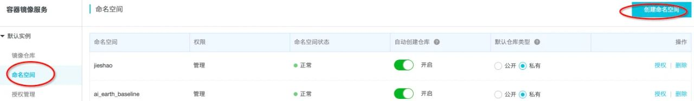
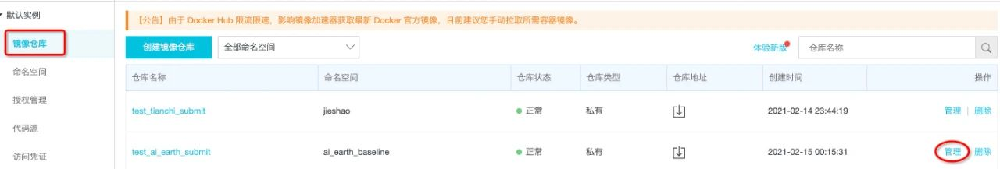
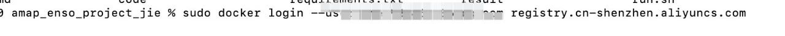
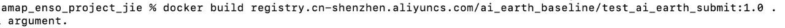
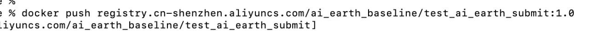
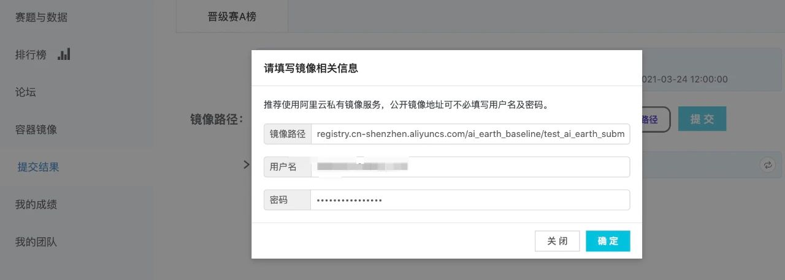

# Docker提交

本次竞赛的Docker提交大致可以分为两小块：

1. 线下文件准备好：包括DockerFile，代码，预测的代码；
2. Build同时pull提交

如果之前没有提交过docker，可以根据这篇教程熟悉一下：https://tianchi.aliyun.com/forum/postDetail?spm=5176.12586969.1002.9.51df4127FoZKeL&postId=165595 


## 线下文件准备

### Requirement 

- 运行代码所依赖的python库，缺什么就把需要装的文件放在requirement下面


```python
numpy
tensorflow==2.2.0 
```

### 运行的代码

#### 放在code下面即可


```python
import tensorflow as tf
import tensorflow.keras.backend as K
from tensorflow.keras.layers import *
from tensorflow.keras.models import *
from tensorflow.keras.optimizers import *
from tensorflow.keras.callbacks import *
from tensorflow.keras.layers import Input 
import numpy as np
import os
import zipfile

def RMSE(y_true, y_pred):
    return tf.sqrt(tf.reduce_mean(tf.square(y_true - y_pred)))

def build_model():  
    inp    = Input(shape=(12,24,72,4))  
    
    x_4    = Dense(1, activation='relu')(inp)   
    x_3    = Dense(1, activation='relu')(tf.reshape(x_4,[-1,12,24,72]))
    x_2    = Dense(1, activation='relu')(tf.reshape(x_3,[-1,12,24]))
    x_1    = Dense(1, activation='relu')(tf.reshape(x_2,[-1,12]))
     
    x = Dense(64, activation='relu')(x_1)  
    x = Dropout(0.25)(x) 
    x = Dense(32, activation='relu')(x)   
    x = Dropout(0.25)(x)  
    output = Dense(24, activation='linear')(x)   
    model  = Model(inputs=inp, outputs=output)

    adam = tf.optimizers.Adam(lr=1e-3,beta_1=0.99,beta_2 = 0.99) 
    model.compile(optimizer=adam, loss=RMSE)

    return model 

model = build_model()
model.load_weights('./user_data/model_data/model_mlp_baseline.h5')

test_path = './tcdata/enso_round1_test_20210201/'

### 1. 测试数据读取
files = os.listdir(test_path)
test_feas_dict = {}
for file in files:
    test_feas_dict[file] = np.load(test_path + file)
    
### 2. 结果预测
test_predicts_dict = {}
for file_name,val in test_feas_dict.items():
    test_predicts_dict[file_name] = model.predict(val).reshape(-1,)
#     test_predicts_dict[file_name] = model.predict(val.reshape([-1,12])[0,:])

### 3.存储预测结果
for file_name,val in test_predicts_dict.items(): 
    np.save('./result/' + file_name,val)

#打包目录为zip文件（未压缩）
def make_zip(source_dir='./result/', output_filename = 'result.zip'):
    zipf = zipfile.ZipFile(output_filename, 'w')
    pre_len = len(os.path.dirname(source_dir))
    source_dirs = os.walk(source_dir)
    print(source_dirs)
    for parent, dirnames, filenames in source_dirs:
        print(parent, dirnames)
        for filename in filenames:
            if '.npy' not in filename:
                continue
            pathfile = os.path.join(parent, filename)
            arcname = pathfile[pre_len:].strip(os.path.sep)   #相对路径
            zipf.write(pathfile, arcname)
    zipf.close()
make_zip() 
```

#### run.sh

- 运行预测的代码


```python
#!/bin/sh
CURDIR="`dirname $0`" #获取此脚本所在目录
echo $CURDIR
cd $CURDIR #切换到该脚本所在目录
python /code/mlp_predict.py
```

### DockerFile


```python
# Base Images
## 从天池基础镜像构建 
FROM registry.cn-shanghai.aliyuncs.com/tcc-public/tensorflow:latest-cuda10.0-py3

## 把当前文件夹里的文件构建到镜像的根目录下（.后面有空格，不能直接跟/）
ADD . /

## 指定默认工作目录为根目录（需要把run.sh和生成的结果文件都放在该文件夹下，提交后才能运行）
WORKDIR /

## Install Requirements（requirements.txt包含python包的版本）
## 这里使用清华镜像加速安装
RUN pip install -i https://pypi.tuna.tsinghua.edu.cn/simple --upgrade pip
RUN pip install -i https://pypi.tuna.tsinghua.edu.cn/simple -r requirements.txt
#RUN pip install -i https://pypi.tuna.tsinghua.edu.cn/simple -r requirements.txt

## 镜像启动后统一执行 sh run.sh
CMD ["sh", "run.sh"]
```

### 其它

- 按照官方要求把所需的文件全部按要求准备好即可。

## 线上提交

在所有的文件都准备之后，下面一步就是进行线上的提交，这里又分为三块。

1. 按照要求进行线上配置
2. 进行build和pull；
3. 提交

### 按照要求进行线上配置



\\ 



 

### 进行build和pull；



\\

\\



```python
#### 1.登录
sudo docker login --username="自己的用户名" registry.cn-shenzhen.aliyuncs.com
#### 2.build
docker build registry.cn-shenzhen.aliyuncs.com/ai_earth_baseline/test_ai_earth_submit:1.0 .
#### 3.push
docker push registry.cn-shenzhen.aliyuncs.com/ai_earth_baseline/test_ai_earth_submit:1.0
```

### 提交




根据自己的不同进行提交即可，如果不出意外，等待一会儿，线上跑完了就会有结果了。


```python

```
