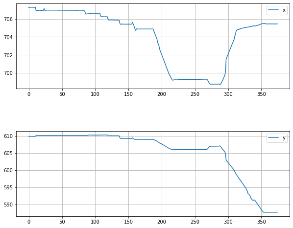
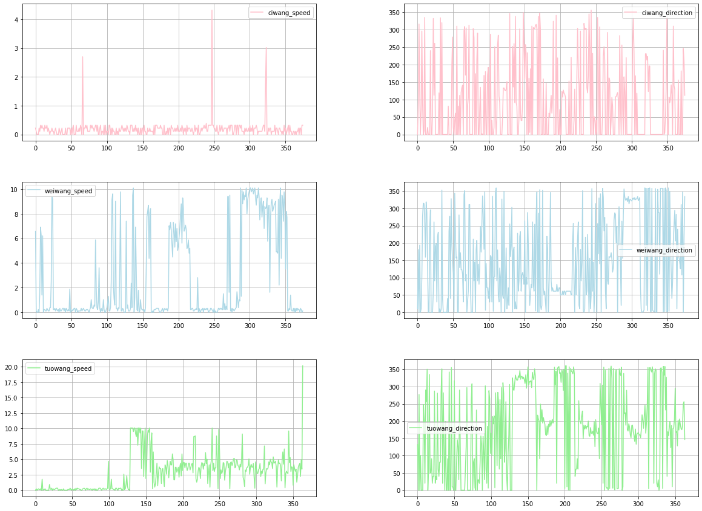
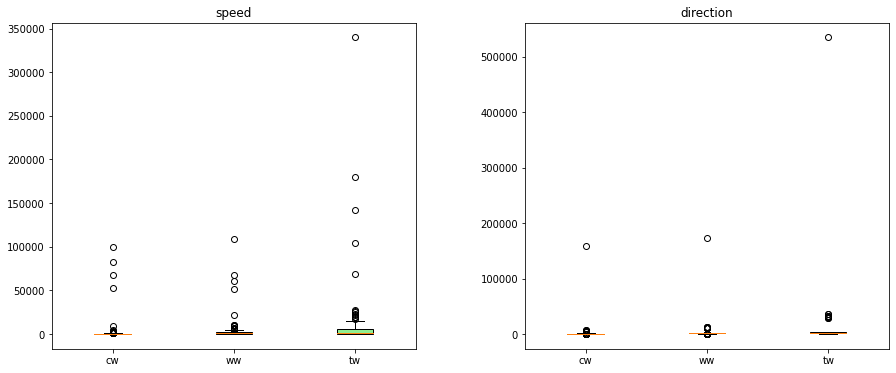

# Datawhale 智慧海洋建设-Task2 数据分析

此部分为智慧海洋建设竞赛的数据分析模块，通过数据分析，可以熟悉数据，为后面的特征工程做准备，欢迎大家后续多多交流。

赛题：智慧海洋建设

数据分析的目的:

- EDA的主要价值在于熟悉整个数据集的基本情况(缺失值、异常值)，来确定所获得数据集可以用于接下来的机器学习或者深度学习使用。


- 了解特征之间的相关性、分布，以及特征与预测值之间的关系。


- 为进行特征工程提供理论依据。

项目地址：https://github.com/datawhalechina/team-learning-data-mining/tree/master/wisdomOcean


比赛地址：https://tianchi.aliyun.com/competition/entrance/231768/introduction?spm=5176.12281957.1004.8.4ac63eafE1rwsY

## 2.1 学习目标

1. 学习如何对数据集整体概况进行进行分析，包括数据集的基本情况(缺失值、异常值)


2. 学习了解变量之间的相互关系、变量与预测值之间的存在关系。


3. 完成相应学习打卡任务

## 2.2 内容介绍

1. 数据总体了解
    - 读取数据集并了解数据集的大小，原始特征维度；
    - 通过info了解数据类型；
    - 粗略查看数据集中各特征的基本统计量
2. 缺失值和唯一值
    - 查看数据缺失值情况
    - 查看唯一值情况
3. 数据特性和特征分布
    - 三类渔船轨迹的可视化
    - 坐标序列可视化
    - 三类渔船速度和方向序列可视化
    - 三类渔船速度和方向的数据分布
4. 总结

## 2.3 代码示例

### 2.3.1 载入各种数据科学以及可视化库

以下库都是pip install安装，有特殊情况我会单独说明  例如 pip install pandas -i https://pypi.tuna.tsinghua.edu.cn/simple


```python
#coding:utf-8
#导入warnings包，利用过滤器来实现忽略警告语句。
import warnings
warnings.filterwarnings('ignore')

import numpy as np
import pandas as pd
from matplotlib import pyplot as plt
import seaborn as sns
```

### 2.3.2 载入其它相关的包


```python
from tqdm import tqdm
import multiprocessing as mp
import os
import pickle
import random
# 把读取所有数据的函数放在单独的python文件中，是为了解决多线程问题在jupyter notebook无法运行的问题
import read_all_data
```

### 说明：

本次数据分析探索，尤其可视化部分均选取某些特定变量进行了举例，所以它只是一个方法的展示而不是整个赛题数据分析的解决方案。

### 2.3.3 定义加载和存储数据的函数


```python
class Load_Save_Data():
    def __init__(self,file_name=None):
        self.filename = file_name

    def load_data(self,Path=None):
        if Path is None:
            assert self.filename is not None,"Invalid Path...."
        else:
            self.filename = Path
        with open(self.filename,"wb") as f:
            data = pickle.load(f)
        return data

    def save_data(self,data,path):
        if path is None:
            assert self.filename is not None,"Invalid path...."
        else:
            self.filename = path
        with open(self.filename,"wb") as f:
            pickle.dump(data,f)
```

### 2.3.4 读取数据


```python
# 定义读取数据的函数
def read_data(Path,Kind=""):
    """
    :param Path:待读取数据的存放路径
    :param Kind:'train' of 'test'
    """

    # 替换成数据存放的路径
    filenames = os.listdir(Path)
    print("\n@Read Data From"+Path+".........................")
    with mp.Pool(processes=mp.cpu_count()) as pool:
        data_total = list(tqdm(pool.map(read_all_data.read_train_file if Kind == "train" else 
                                        read_all_data.read_test_file,filenames),total=len(filenames)))
    print("\n@End Read total Data............................")
    load_save = Load_Save_Data()
    if Kind == "train":
        load_save.save_data(data_total,"./data_tmp/total_data.pkl")
    return data_total
```


```python
# 训练数据读取

# 存放数据的绝对路径
train_path = "D:/code_sea/data/train/hy_round1_train_20200102/"
data_train = read_data(train_path,Kind="train")
data_train = pd.concat(data_train)

# 测试数据读取

# 存放数据的绝对路径
test_path = "D:/code_sea/data/test/hy_round1_testA_20200102/"
data_test = read_data(test_path,Kind="test")
data_test = pd.concat(data_test)
```

    
    @Read Data FromD:/code_sea/data/train/hy_round1_train_20200102/.........................
    

    100%|█████████████████████████████████████████████████████████████████████████| 7000/7000 [00:00<00:00, 3527165.79it/s]
    

    
    @End Read total Data............................
    
    @Read Data FromD:/code_sea/data/test/hy_round1_testA_20200102/.........................
    

    100%|██████████████████████████████████████████████████████████████████████████████████████| 2000/2000 [00:00<?, ?it/s]
    

    
    @End Read total Data............................
    

### 2.3.5 总体了解数据

#### 查看数据集的样本个数和原始特征维度


```python
data_test.shape
```


    (782378, 6)


```python
data_train.shape
```


    (2699638, 7)


```python
data_train.columns
```


    Index(['渔船ID', 'x', 'y', '速度', '方向', 'time', 'type'], dtype='object')


查看一下具体的列名，赛题理解部分已经给出具体的特征含义，这里方便阅读再给一下

- 渔船ID：渔船的唯一识别，结果文件以此ID为标识
- x：渔船在平面坐标系下的x轴坐标
- y：渔船在平面坐标系下的y轴坐标
- 速度：渔船当前时刻的航速，单位节
- 方向：渔船当前时刻的航首向，单位度
- time：数据上报时刻，单位月日 时:分
- type：渔船label，作业类型


```python
pd.options.display.max_info_rows = 2699639
data_train.info()
```

    <class 'pandas.core.frame.DataFrame'>
    Int64Index: 2699638 entries, 0 to 365
    Data columns (total 7 columns):
     #   Column  Non-Null Count    Dtype  
    ---  ------  --------------    -----  
     0   渔船ID    2699638 non-null  int64  
     1   x       2699638 non-null  float64
     2   y       2699638 non-null  float64
     3   速度      2699638 non-null  float64
     4   方向      2699638 non-null  int64  
     5   time    2699638 non-null  object 
     6   type    2699638 non-null  object 
    dtypes: float64(3), int64(2), object(2)
    memory usage: 164.8+ MB
    


```python
data_train.describe([0.01,0.025,0.05,0.5,0.75,0.9,0.99])
```


<div>
<style scoped>
    .dataframe tbody tr th:only-of-type {
        vertical-align: middle;
    }

    .dataframe tbody tr th {
        vertical-align: top;
    }

    .dataframe thead th {
        text-align: right;
    }
</style>
<table border="1" class="dataframe">
  <thead>
    <tr style="text-align: right;">
      <th></th>
      <th>渔船ID</th>
      <th>x</th>
      <th>y</th>
      <th>速度</th>
      <th>方向</th>
    </tr>
  </thead>
  <tbody>
    <tr>
      <th>count</th>
      <td>2.699638e+06</td>
      <td>2.699638e+06</td>
      <td>2.699638e+06</td>
      <td>2.699638e+06</td>
      <td>2.699638e+06</td>
    </tr>
    <tr>
      <th>mean</th>
      <td>3.496035e+03</td>
      <td>6.277243e+06</td>
      <td>5.271190e+06</td>
      <td>1.784449e+00</td>
      <td>1.151533e+02</td>
    </tr>
    <tr>
      <th>std</th>
      <td>2.020781e+03</td>
      <td>2.698065e+05</td>
      <td>2.544160e+05</td>
      <td>2.478862e+00</td>
      <td>1.168515e+02</td>
    </tr>
    <tr>
      <th>min</th>
      <td>0.000000e+00</td>
      <td>5.000250e+06</td>
      <td>3.345433e+06</td>
      <td>0.000000e+00</td>
      <td>0.000000e+00</td>
    </tr>
    <tr>
      <th>1%</th>
      <td>6.900000e+01</td>
      <td>5.258862e+06</td>
      <td>4.618927e+06</td>
      <td>0.000000e+00</td>
      <td>0.000000e+00</td>
    </tr>
    <tr>
      <th>2.5%</th>
      <td>1.710000e+02</td>
      <td>5.817836e+06</td>
      <td>4.920685e+06</td>
      <td>0.000000e+00</td>
      <td>0.000000e+00</td>
    </tr>
    <tr>
      <th>5%</th>
      <td>3.470000e+02</td>
      <td>6.024286e+06</td>
      <td>4.985102e+06</td>
      <td>0.000000e+00</td>
      <td>0.000000e+00</td>
    </tr>
    <tr>
      <th>50%</th>
      <td>3.502000e+03</td>
      <td>6.246522e+06</td>
      <td>5.229463e+06</td>
      <td>3.200000e-01</td>
      <td>8.100000e+01</td>
    </tr>
    <tr>
      <th>75%</th>
      <td>5.243000e+03</td>
      <td>6.365916e+06</td>
      <td>5.379267e+06</td>
      <td>3.290000e+00</td>
      <td>2.170000e+02</td>
    </tr>
    <tr>
      <th>90%</th>
      <td>6.290000e+03</td>
      <td>6.592496e+06</td>
      <td>5.602273e+06</td>
      <td>4.910000e+00</td>
      <td>2.930000e+02</td>
    </tr>
    <tr>
      <th>99%</th>
      <td>6.928000e+03</td>
      <td>7.056209e+06</td>
      <td>6.111650e+06</td>
      <td>1.009000e+01</td>
      <td>3.560000e+02</td>
    </tr>
    <tr>
      <th>max</th>
      <td>6.999000e+03</td>
      <td>7.133785e+06</td>
      <td>7.667581e+06</td>
      <td>1.001600e+02</td>
      <td>3.600000e+02</td>
    </tr>
  </tbody>
</table>
</div>


```python
data_train.head(3).append(data_train.tail(3))
```


<div>
<style scoped>
    .dataframe tbody tr th:only-of-type {
        vertical-align: middle;
    }

    .dataframe tbody tr th {
        vertical-align: top;
    }

    .dataframe thead th {
        text-align: right;
    }
</style>
<table border="1" class="dataframe">
  <thead>
    <tr style="text-align: right;">
      <th></th>
      <th>渔船ID</th>
      <th>x</th>
      <th>y</th>
      <th>速度</th>
      <th>方向</th>
      <th>time</th>
      <th>type</th>
    </tr>
  </thead>
  <tbody>
    <tr>
      <th>0</th>
      <td>0</td>
      <td>6.152038e+06</td>
      <td>5.124873e+06</td>
      <td>2.59</td>
      <td>102</td>
      <td>1110 11:58:19</td>
      <td>拖网</td>
    </tr>
    <tr>
      <th>1</th>
      <td>0</td>
      <td>6.151230e+06</td>
      <td>5.125218e+06</td>
      <td>2.70</td>
      <td>113</td>
      <td>1110 11:48:19</td>
      <td>拖网</td>
    </tr>
    <tr>
      <th>2</th>
      <td>0</td>
      <td>6.150421e+06</td>
      <td>5.125563e+06</td>
      <td>2.70</td>
      <td>116</td>
      <td>1110 11:38:19</td>
      <td>拖网</td>
    </tr>
    <tr>
      <th>363</th>
      <td>999</td>
      <td>6.138413e+06</td>
      <td>5.162715e+06</td>
      <td>0.32</td>
      <td>0</td>
      <td>1031 12:28:01</td>
      <td>拖网</td>
    </tr>
    <tr>
      <th>364</th>
      <td>999</td>
      <td>6.138413e+06</td>
      <td>5.162715e+06</td>
      <td>0.32</td>
      <td>0</td>
      <td>1031 12:18:00</td>
      <td>拖网</td>
    </tr>
    <tr>
      <th>365</th>
      <td>999</td>
      <td>6.138413e+06</td>
      <td>5.162715e+06</td>
      <td>0.11</td>
      <td>294</td>
      <td>1031 12:07:59</td>
      <td>拖网</td>
    </tr>
  </tbody>
</table>
</div>


### 2.3.6查看数据集中特征缺失值、唯一值等

查看缺失值


```python
print(f'There are {data_train.isnull().any().sum()} columns in train dataset with missing values.')
```

    There are 0 columns in train dataset with missing values.
    

查看训练集测试集中特征属性只有一值的特征


```python
one_value_fea = [col for col in data_train.columns if data_train[col].nunique() <= 1]
```


```python
one_value_fea_test = [col for col in data_test.columns if data_test[col].nunique() <= 1]
```


```python
one_value_fea
```


    []


```python
one_value_fea_test
```


    []


```python
print(f'There are {len(one_value_fea)} columns in train dataset with one unique value.')
print(f'There are {len(one_value_fea_test)} columns in test dataset with one unique value.')
```

    There are 0 columns in train dataset with one unique value.
    There are 0 columns in test dataset with one unique value.
    

## 总结:

6列特征中0列有缺少数据，不存在有唯一值的列，有连续特征和分类特征

## 2.4 数据特性和特征分布

### 2.4.1 三类渔船轨迹可视化


```python
# 把训练集的所有数据,根据类别存放到不同的数据文件中
def get_diff_data():
    Path = "./data_tmp/total_data.pkl"
    with open(Path,"rb") as f:
        total_data = pickle.load(f)

    load_save = Load_Save_Data()

    kind_data = ["刺网","围网","拖网"]
    file_names = ["ciwang_data.pkl","weiwang_data.pkl","tuowang_data.pkl"]
    for i,datax in enumerate(kind_data):
        data_type =  [data for data in total_data if data["type"].unique()[0] == datax]
        load_save.save_data(data_type,"./data_tmp/" + file_names[i])
```


```python
get_diff_data()
```


```python
# 从存放某个轨迹类别的数据文件中，随机读取某个渔船的数据
def get_random_one_traj(type=None):
    """
    :param type:"ciwang","weiwang" or "tuowang"
    """
    
    np.random.seed(10)
    path = "./data_tmp/"
    with open(path + type + ".pkl","rb") as f1:
        data = pickle.load(f1)
    length = len(data)
    index = np.random.choice(length)
    return data[index]
```


```python
# 分别从三个类别的数据文件中，随机读取某三个渔船的数据
def get_random_three_traj(type=None):
    """
    :param type:"ciwang","weiwang" or "tuowang"
    """
    
    random.seed(10)
    path = "./data_tmp/"
    with open(path + type + ".pkl", "rb") as f:
        data = pickle.load(f)
    data_arrange = np.arange(len(data)).tolist()
    index = random.sample(data_arrange,3)
    return data[index[0]],data[index[1]],data[index[2]]
```


```python
# 每个类别中随机三个渔船的轨迹进行可视化
def visualize_three_traj():
    fig,axes = plt.subplots(nrows=3,ncols=3,figsize=(20,15))
    plt.subplots_adjust(wspace=0.2,hspace=0.2)
    # 对于每一个类别，随机选出刺网的三条轨迹进行可视化
    lables = ["ciwang","weiwang","tuowang"]
    for i,file_type in tqdm(enumerate(["ciwang_data","weiwang_data","tuowang_data"])):
        data1, data2, data3 = get_random_three_traj(type=file_type)
        for j, datax in enumerate([data1, data2, data3]):
            x_data = datax["x"].loc[-1:].values
            y_data = datax["y"].loc[-1:].values
            axes[i][j - 1].scatter(x_data[0], y_data[0], label="start", c="red", s=10, marker="8")
            axes[i][j - 1].plot(x_data, y_data, label=lables[i])
            axes[i][j - 1].scatter(x_data[len(x_data) - 1], y_data[len(y_data) - 1], label="end", c="green", s=10,
                                   marker="v")
            axes[i][j - 1].grid(alpha=2)
            axes[i][j - 1].legend(loc="best")

    plt.show()
```


```python
visualize_three_traj()
```

    3it [00:02,  1.03it/s]
    


#### 总结:

1. 可以看到不同轨迹虽然有不同的变化，但是仍然不具有很强的区分性。
    - 刺网的轨迹偏向于具有规则多边形的情形。
    - 围网的部分轨迹偏向于围城一个圈的情形。
    - 拖网的轨迹偏向于点到点，没有拐角的情形。
    - 整体上来说，不同类别的轨迹仍然不具有很强的区别分性。

2. 通过取不同的随机数，发现存在异常轨迹，轨迹中只存在几个点。

### 2.4.2 坐标序列可视化


```python
# 随机选取某条数据，观察x坐标序列和y坐标序列的变化情况
def visualize_one_traj_x_y():
    fig,axes = plt.subplots(nrows=2,ncols=1,figsize=(10,8))
    plt.subplots_adjust(wspace=0.5,hspace=0.5)

    data1 = get_random_one_traj(type="weiwang_data")
    x = data1["x"].loc[-1:]
    x = x / 10000
    
    y = data1["y"].loc[-1:]
    y = y / 10000

    arr1 = np.arange(len(x))
    arr2 = np.arange(len(y))

    axes[0].plot(arr1,x,label="x")
    axes[1].plot(arr2,y,label="y")
    axes[0].grid(alpha=3)
    axes[0].legend(loc="best")
    axes[1].grid(alpha=3)
    axes[1].legend(loc="best")
    plt.show()
```


```python
visualize_one_traj_x_y()
```





#### 总结:

1.  通过对坐标x和坐标y序列的可视化，发现两个序列存在同时不变的情况，因此可以判断存在POI点。

### 2.4.3 三类渔船速度和方向可视化


```python
# 每类轨迹，随机选取某个渔船，可视化速度序列和方向序列
def visualize_three_traj_speed_direction():
    fig,axes = plt.subplots(nrows=3,ncols=2,figsize=(20,15))
    plt.subplots_adjust(wspace=0.3,hspace=0.3)
    # 随机选出刺网的三条轨迹进行可视化
    file_types = ["ciwang_data","weiwang_data","tuowang_data"]
    speed_types = ["ciwang_speed","weiwang_speed","tuowang_speed"]
    doirections = ["ciwang_direction","weiwang_direction","tuowang_direction"]
    colors = ['pink', 'lightblue', 'lightgreen']
    for i,file_name in tqdm(enumerate(file_types)):
        datax = get_random_one_traj(type=file_name)
        x_data = datax["速度"].loc[-1:].values
        y_data = datax["方向"].loc[-1:].values
        axes[i][0].plot(range(len(x_data)), x_data, label=speed_types[i], color=colors[i])
        axes[i][0].grid(alpha=2)
        axes[i][0].legend(loc="best")
        axes[i][1].plot(range(len(y_data)), y_data, label=doirections[i], color=colors[i])
        axes[i][1].grid(alpha=2)
        axes[i][1].legend(loc="best")

    plt.show()
```


```python
visualize_three_traj_speed_direction()
```

    3it [00:02,  1.03it/s]
    





### 总结:

1. 不同轨迹速度的数据分布，均存在连续的低值，因此强化了对POI点存在的判断。

2. 每个类别的渔船方向变化很快，可以判定为渔船在海上漂泊造成，因此此特征对于类别的判断不具有很强的区分性。

### 2.4.4 三类渔船速度和方向的数据分布


```python
# 对某一特征进行数据统计
def get_data_cummulation(type=None,path=None,kind=None,columns=None):
    """
    :param type:"ciwang","weiwang" or "tuowang"
    :param path:存放数据路径
    :param kind: '速度' or  '方向'
    :param columns:与kind对应，'speed' or 'direction'
    """
    
    data_dict = dict()
    with open(path + type+".pkl","rb") as file:
        data_list = pickle.load(file)
    for datax in tqdm(data_list):
        data = datax[kind].values
        for speed in data:
            data_dict.setdefault(speed,0)
            data_dict[speed] += 1
    data_dict = dict(sorted(data_dict.items(),key=lambda x:x[0],reverse=False))
    data_df = pd.DataFrame.from_dict(data_dict,columns=[columns],orient="index")
    return data_df
```


```python
# 分别得到速度和方向的分布数据
def get_speed_and_direction_distribution_data(type=None):
    """
    :param type:"ciwang","weiwang" or "tuowang"
    """
    
    path = "./data_tmp/"
    data_speed_df = get_data_cummulation(type=type, path=path,kind="速度",columns="speed")
    data_direction_df = get_data_cummulation(type=type,path=path,kind="方向",columns="direction")
    return data_speed_df,data_direction_df
```


```python
# 可视化速度和方向的数据分布
df_speeds = []
df_directions = []


def plot_speed_direction1_distribution():
    plt.subplots(nrows=1, ncols=2, figsize=(15, 6))
    plt.subplots_adjust(wspace=0.3, hspace=0.5)

    file_types = ["ciwang_data", "weiwang_data", "tuowang_data"]
    lables = ["target==cw", "target==ww", "target==tw"]
    colors = ["red", "green", "blue"]

    for i, filenames in enumerate(file_types):
        df11, df21 = get_speed_and_direction_distribution_data(file_types[i])
        plt.subplot(1,2,1)
        ax1 = sns.kdeplot(df11["speed"].values / 1000000, color=colors[i],shade=True)
        plt.subplot(1,2,2)
        ax3 = sns.kdeplot(df21["direction"].values / 1000000, color=colors[i],shade=True)
        df_speeds.append(df11)
        df_directions.append(df21)
    ax1.legend(lables)
    ax1.set_xlabel("Speed")
    ax3.set_xlabel("Direction")
    ax3.legend(lables)
    plt.show()
```


```python
plot_speed_direction1_distribution()
```

    100%|████████████████████████████████████████████████████████████████████████████| 1018/1018 [00:00<00:00, 6898.08it/s]
    100%|████████████████████████████████████████████████████████████████████████████| 1018/1018 [00:00<00:00, 7912.51it/s]
    100%|████████████████████████████████████████████████████████████████████████████| 1621/1621 [00:00<00:00, 6744.18it/s]
    100%|████████████████████████████████████████████████████████████████████████████| 1621/1621 [00:00<00:00, 7929.84it/s]
    100%|████████████████████████████████████████████████████████████████████████████| 4361/4361 [00:00<00:00, 6107.10it/s]
    100%|████████████████████████████████████████████████████████████████████████████| 4361/4361 [00:00<00:00, 7133.23it/s]
    


```python
# 使用分位图对速度和方向的数据分布进行可视化
def plot_speed_direction2_distribution():
    fig,axes = plt.subplots(nrows=1, ncols=2, figsize=(15, 6))
    plt.subplots_adjust(wspace=0.3, hspace=0.5)
    colors_box = ['pink', 'lightblue', 'lightgreen']

    bplot1 = axes[0].boxplot([df_speeds[0]["speed"].values,df_speeds[1]["speed"].values,df_speeds[2]["speed"].values]
                       , vert=True
                       , patch_artist=True
                       , labels=["cw", "ww", "tw"])
    bplot2 = axes[1].boxplot([df_directions[0]["direction"].values, df_directions[1]["direction"].values, df_directions[2]["direction"].values]
                       , vert=True
                       , patch_artist=True
                       , labels=["cw", "ww", "tw"])

    for blpot in (bplot1,bplot2):
        for patch,color in zip(blpot["boxes"],colors_box):
            patch.set_facecolor(color)

    axes[0].set_title("speed")
    axes[1].set_title("direction")
    plt.show()
```


```python
plot_speed_direction2_distribution()
```





#### 总结

1. 无论是分布图，还是分位图，都可以发现不同类型轨迹的速度数据分布存在很大的差异。
2. 无论是分布图，还是分位图，都可以发现不同类型轨迹的方向数据分布差异不是特别明显。

## 总结

通过以上的数据分析，我们可以得到以下结论

1. 每个特征中不存在缺失值和唯一值。


2. 存在异常轨迹，该轨迹只含有几个点。


3. 虽然不同类别的轨迹有不同的变化倾向，但是整体来说，不具有很强的区分性。


4. 通过对坐标序列的分析，发现存在POI点。


5. 通过对不同类别的速度数据分布可视化，发现速度具有很强的区分性。


6. 通过对不同类别的方向数据分布可视化，发现方向的区分性不是特别强。
